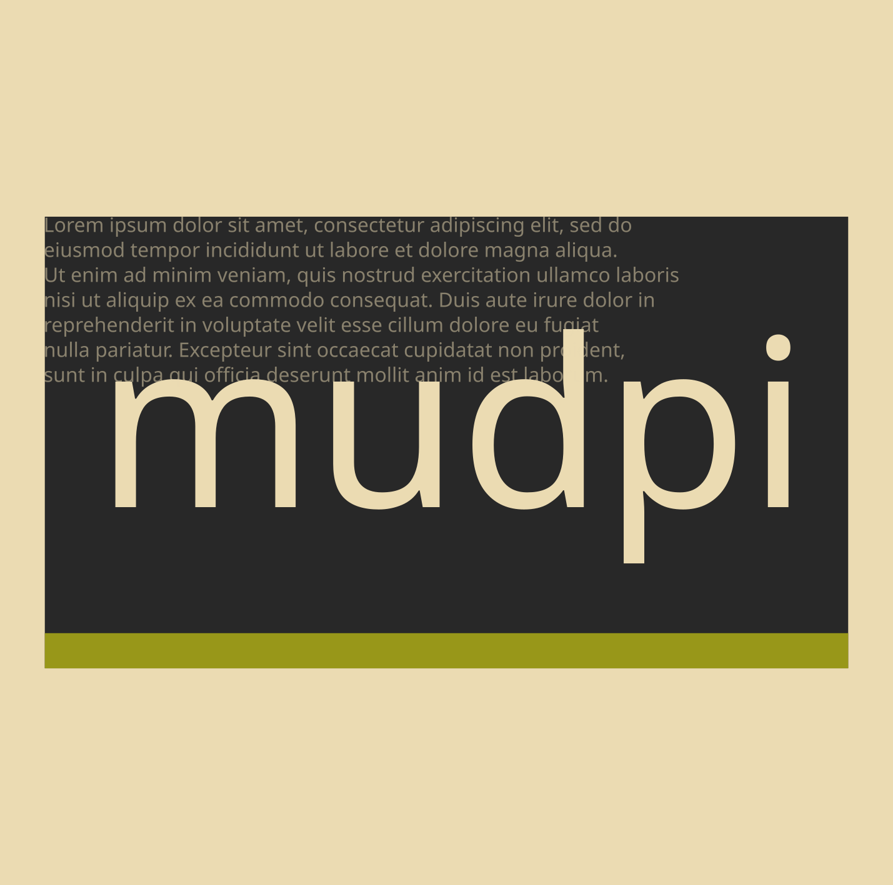
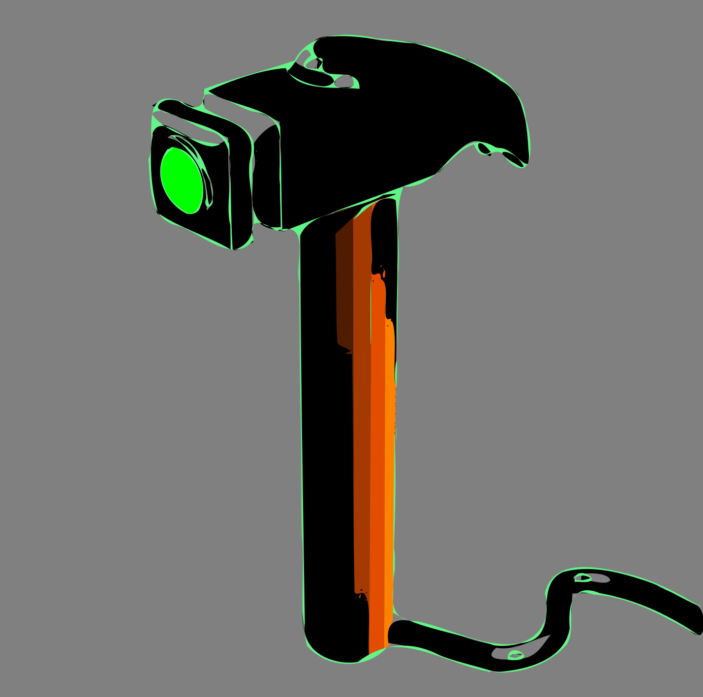

---
title: 'Mudpi'
subtitle: 'Workstation environment'
...

{width=256px}

## Scope

Scripts and dotfiles.

## References

- @ext [github](https://github.com/vukv93/mudpi)
- [nouua](nouua.html)
- [cover](index.html)
- @ext [nouua.com](https://nouua.com)

## Etymology

An acronym, refers to a recipe.

## Tool

{width=256px}
